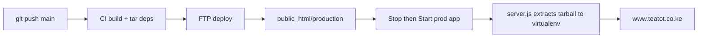

# Deployment — Tea Tot Hotel (cPanel)

## Server layout

| | Path |
|---|------|
| Account home | `/home/teatotco` |
| Development site | `/home/teatotco/public_html/development` |
| Development virtualenv deps | `/home/teatotco/nodevenv/public_html/development/22/lib/node_modules` |
| Production site | `/home/teatotco/public_html/production` |
| Production virtualenv deps | `/home/teatotco/nodevenv/public_html/production/22/lib/node_modules` |

FTP `server-dir` is **relative to account home** (`/home/teatotco`).

**Do not deploy production into bare `public_html/`.** Keep prod in `public_html/production` (sibling of `development`). Point the primary domain document root at that folder in cPanel Domains. Isolates env, Passenger paths, and virtualenvs.

## Branch → environment

| Branch    | URL                      | App path    | Build trigger        |
|-----------|--------------------------|-------------|----------------------|
| `develop` | https://dev.teatot.co.ke   | `public_html/development`  | push → GitHub Actions |
| `main`    | https://www.teatot.co.ke   | `public_html/production`   | push → GitHub Actions |

**Everything builds in GitHub Actions.** Dependencies ship as `tmp/node_modules.tar.gz` and extract into the CloudLinux virtualenv on app start — never click **Run NPM Install** after deploy.

Optional legacy path: `.cpanel.yml` + `scripts/cpanel-deploy.sh` only for **develop** via cPanel Git Version Control. Production = GitHub Actions only.

---

## One-time setup (shared)

### 1. GitHub repository secrets

| Secret | Value |
|--------|-------|
| `CPANEL_FTP_HOST` | FTP host |
| `CPANEL_FTP_USER` | `teatotco` (FTP root must be `/home/teatotco`) |
| `CPANEL_FTP_PASSWORD` | cPanel password |

Same FTP account serves both `public_html/development/` and `public_html/production/`.

### 2. Subdomain (development)

1. cPanel → **Domains** → **dev.teatot.co.ke** → document root `public_html/development`
2. Enable SSL (AutoSSL)

### 3. Primary domain (production)

1. cPanel → **Domains** → **teatot.co.ke** (and **www.teatot.co.ke**) → document root `public_html/production`
2. Enable SSL (AutoSSL) for both apex and www
3. Prefer redirect apex → www (or reverse) so canonical URL matches `NEXT_PUBLIC_SITE_URL`

---

## Development Node.js app

cPanel → **Setup Node.js App** → **Create Application**:

| Field | Value |
|-------|-------|
| Node.js version | **22.x** |
| Application mode | Production |
| Application root | `public_html/development` |
| Application URL | `dev.teatot.co.ke` |
| Application startup file | `server.js` |

On first create, cPanel adds a `node_modules` **symlink** in the app root pointing at the virtualenv. Do not delete that symlink.

### Development environment variables (cPanel UI only)

Set under the Node.js app → **Environment variables**. Never commit secrets.

| Variable | Value |
|----------|-------|
| `NODE_ENV` | `production` |
| `NODE_OPTIONS` | `--max-old-space-size=512` |
| `NEXT_PUBLIC_SITE_URL` | `https://dev.teatot.co.ke` |
| `CONTACT_EMAIL` | `info@teatot.co.ke` |
| `SMTP_HOST` | (your SMTP host) |
| `SMTP_PORT` | `587` |
| `SMTP_USER` | (mailbox user) |
| `SMTP_PASSWORD` | (mailbox password) |
| `NEXT_PUBLIC_GOOGLE_MAPS_EMBED_KEY` | (optional) |
| `NEXT_PUBLIC_GA_MEASUREMENT_ID` | `G-9B8TV2N3WT` (optional on cPanel; **required in GitHub Actions build**) |
| `NEXT_PUBLIC_META_PIXEL_ID` | (optional) |

`NEXT_PUBLIC_*` for **build-time** live in `.github/workflows/deploy-*.yml` (`NEXT_PUBLIC_SITE_URL`, `NEXT_PUBLIC_GA_MEASUREMENT_ID`). Runtime secrets (`SMTP_*`) belong only in cPanel. Do **not** paste a second Google tag into `layout.tsx` — `components/Analytics.tsx` already injects gtag once.

---

## Production Node.js app (one-time)

cPanel → **Setup Node.js App** → **Create Application** (second app, separate from development):

| Field | Value |
|-------|-------|
| Node.js version | **22.x** (must match `22` in virtualenv path) |
| Application mode | Production |
| Application root | `public_html/production` |
| Application URL | `www.teatot.co.ke` (or apex if that is canonical) |
| Application startup file | `server.js` |

Keep the `node_modules` symlink cPanel creates. Do not delete it.

### Production environment variables (cPanel UI only)

Separate from the development app — editing one does not touch the other.

| Variable | Value |
|----------|-------|
| `NODE_ENV` | `production` |
| `NODE_OPTIONS` | `--max-old-space-size=512` |
| `NEXT_PUBLIC_SITE_URL` | `https://www.teatot.co.ke` |
| `CONTACT_EMAIL` | `info@teatot.co.ke` |
| `SMTP_HOST` | (production SMTP host) |
| `SMTP_PORT` | `587` |
| `SMTP_USER` | (production mailbox) |
| `SMTP_PASSWORD` | (production mailbox password) |
| `NEXT_PUBLIC_GOOGLE_MAPS_EMBED_KEY` | (optional) |
| `NEXT_PUBLIC_GA_MEASUREMENT_ID` | `G-9B8TV2N3WT` (build-time — already in workflow) |

**Do not upload `.env` / `.env.production` via FTP.** Those files are not in the deploy bundle. Secrets live in the Node.js App Manager UI so develop and production stay isolated.

Build-time public vars for production are set in `.github/workflows/deploy-production.yml`:

```yaml
NEXT_PUBLIC_SITE_URL: https://www.teatot.co.ke
NEXT_PUBLIC_GA_MEASUREMENT_ID: G-9B8TV2N3WT
```

---

## Deploy (development)

```bash
git push origin develop
```

GitHub Actions will:

1. `npm ci` + `npm run build`
2. Pack runtime deps as `tmp/node_modules.tar.gz`
3. FTP → `public_html/development/`

### After each develop deploy

1. cPanel → **Setup Node.js App** → development app → **STOP**
2. Wait for GitHub Actions to finish
3. **START** the app — first start may take ~30s while deps extract
4. Open https://dev.teatot.co.ke/

**Do not click Run NPM Install.**

---

## Deploy (production)

```bash
# From a verified develop tip (or merge PR into main)
git checkout main
git merge develop   # or merge via GitHub PR
git push origin main
```

GitHub Actions (`.github/workflows/deploy-production.yml`) will:

1. `npm ci` + `npm run build` with production `NEXT_PUBLIC_SITE_URL`
2. `node scripts/stage-standalone.mjs production` → `deploy/production/` (includes production Passenger `.htaccess`)
3. FTP → `public_html/production/`

### After each production deploy

1. cPanel → **Setup Node.js App** → **production** app → **STOP**
2. Wait for GitHub Actions to finish (green check on `main`)
3. **START** the production app
4. Open https://www.teatot.co.ke/ and spot-check booking/contact forms
5. Confirm develop still up at https://dev.teatot.co.ke/ (separate app — untouched)

**Do not click Run NPM Install.**

---

## How deploy works



One FTP upload (including one ~80 MB tarball) avoids FTPS dropping on thousands of tiny `node_modules` files. `server.js` extracts into the CloudLinux virtualenv when the SHA changes.

---

## cPanel checklist — bring production live

Terminal-ready / UI sequence:

1. Confirm GitHub secrets `CPANEL_FTP_*` exist (same as develop).
2. cPanel → **File Manager** → create folder `public_html/production` if missing.
3. cPanel → **Domains** → set `teatot.co.ke` + `www.teatot.co.ke` document root to `public_html/production`.
4. Wait for AutoSSL (or force issue).
5. cPanel → **Setup Node.js App** → create app with root `public_html/production`, Node 22, startup `server.js`.
6. In that app, add production env vars listed above (SMTP + `NEXT_PUBLIC_SITE_URL`).
7. Optionally open the app’s `.htaccess` in File Manager and confirm Passenger paths match `config/passenger-production.htaccess`. If cPanel rewrote them on create, keep the cPanel values.
8. Merge approved work into `main` and `git push origin main`.
9. Watch Actions: **Deploy production**.
10. Stop → Start the production Node app.
11. Verify https://www.teatot.co.ke/ (and booking email).

No SSH keys required for the current FTP pipeline. No second cPanel Git repo for `main` unless you intentionally abandon GitHub Actions for production.

---

## One-time cleanup (if npm install was already broken)

Stop the app, then run **once** via Cron Jobs (adjust path for production):

```text
rm -rf /home/teatotco/nodevenv/public_html/development/22/lib/node_modules && mkdir -p /home/teatotco/nodevenv/public_html/development/22/lib/node_modules
```

```text
rm -rf /home/teatotco/nodevenv/public_html/production/22/lib/node_modules && mkdir -p /home/teatotco/nodevenv/public_html/production/22/lib/node_modules
```

Then redeploy and **Start** the matching app.

---

## Troubleshooting

| Symptom | Fix |
|---------|-----|
| **FTP FIN packet / connection closed** | Fixed by shipping `tmp/node_modules.tar.gz` instead of uploading `node_modules` file-by-file. |
| **ENOTEMPTY on Run NPM Install** | Do not use Run NPM Install. Use deploy + Stop → Start. |
| **Cannot find module 'next'** | Stop app, confirm `tmp/node_modules.tar.gz` exists, Start app, check `stderr.log` for extract errors. |
| **503 on first start after deploy** | Extraction can take ~30s — wait and refresh. If it persists, check `stderr.log`. |
| **503** | Confirm `.htaccess` exists and Passenger paths match the app folder. Stop → Start. |
| **Wrong site / wrong env** | Confirm domain document root and which Node app you restarted. |
| **Wrong Node version on cPanel** | Virtualenv path uses your Node major version (e.g. `22`). |
| **Contact/booking email fails on prod only** | Check production app SMTP env vars — develop vars do not apply. |
