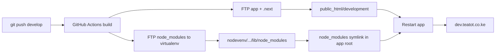

# Deployment — Tea Tot Hotels (cPanel)

## Server layout

| | Path |
|---|------|
| Account home | `/home/teatotco` |
| Development site | `/home/teatotco/public_html/development` |
| Development virtualenv deps | `/home/teatotco/nodevenv/public_html/development/22/lib/node_modules` |
| Production site | `/home/teatotco/public_html/production` |

FTP `server-dir` is **relative to account home** (`/home/teatotco`).

## Branch → environment

| Branch    | URL                      | App path    | Build trigger        |
|-----------|--------------------------|-------------|----------------------|
| `develop` | https://dev.teatot.co.ke   | `public_html/development`  | push → GitHub Actions |
| `main`    | https://www.teatot.co.ke   | `public_html/production`   | push → GitHub Actions |

**Everything builds in GitHub Actions.** Dependencies are installed in CI and uploaded to the CloudLinux **virtualenv** — you never run **Run NPM Install** on cPanel after deploy.

---

## One-time setup

### 1. GitHub repository secrets

| Secret | Value |
|--------|-------|
| `CPANEL_FTP_HOST` | FTP host |
| `CPANEL_FTP_USER` | `teatotco` (FTP root must be `/home/teatotco`) |
| `CPANEL_FTP_PASSWORD` | cPanel password |

### 2. Subdomain (development)

1. cPanel → **Domains** → **dev.teatot.co.ke** → document root `public_html/development`
2. Enable SSL (AutoSSL)

### 3. Node.js application (development)

cPanel → **Setup Node.js App** → **Create Application**:

| Field | Value |
|-------|-------|
| Node.js version | **22.x** (must match `22` in virtualenv FTP path) |
| Application mode | Production |
| Application root | `public_html/development` |
| Application URL | `dev.teatot.co.ke` |
| Application startup file | `server.js` |

On first create, cPanel adds a `node_modules` **symlink** in the app root pointing at the virtualenv. Do not delete that symlink.

### 4. Environment variables

| Variable | Development |
|----------|-------------|
| `NODE_ENV` | `production` |
| `NODE_OPTIONS` | `--max-old-space-size=512` |
| `NEXT_PUBLIC_SITE_URL` | `https://dev.teatot.co.ke` |
| `CONTACT_EMAIL` | `info@teatot.co.ke` |

---

## Deploy (development)

```bash
git push origin develop
```

GitHub Actions will:

1. `npm ci` + `npm run build`
2. Install 4 runtime packages in CI (`next`, `react`, `react-dom`, `nodemailer`)
3. FTP app files → `public_html/development/`
4. FTP `node_modules` → `nodevenv/public_html/development/22/lib/node_modules/` (clean replace each deploy)

### After each deploy

1. cPanel → **Setup Node.js App** → **Restart** (or Stop → Start)
2. Open https://dev.teatot.co.ke/

**Do not click Run NPM Install** — that step is obsolete and causes ENOTEMPTY errors on shared hosting.

---

## How the permanent fix works



CloudLinux forbids a real `node_modules` folder in the app root but allows a symlink to the virtualenv. Server-side `npm install` is slow, memory-limited, and leaves corrupted partial installs (ENOTEMPTY). CI installs deps on a full Ubuntu runner and FTP replaces the virtualenv folder atomically each deploy.

---

## One-time cleanup (if npm install was already broken)

Stop the app, then run this **once** via Cron Jobs:

```text
rm -rf /home/teatotco/nodevenv/public_html/development/22/lib/node_modules && mkdir -p /home/teatotco/nodevenv/public_html/development/22/lib/node_modules
```

Then push to `develop` and let GitHub Actions repopulate the virtualenv. Restart the app.

---

## Troubleshooting

| Symptom | Fix |
|---------|-----|
| **ENOTEMPTY on Run NPM Install** | Stop using Run NPM Install. Push `develop` so CI uploads deps. One-time cron cleanup above if virtualenv is corrupted. |
| **Cannot find module 'next'** | Virtualenv upload failed — check GitHub Actions FTP step. Confirm `node_modules` symlink exists in app root. Restart app. |
| **503** | Restart app; confirm `.htaccess` exists. |
| **Wrong Node version on cPanel** | Virtualenv path uses `/22/` — must match Node 22.x in Setup Node.js App. Update workflow `server-dir` if you change version. |
| FTP fails on virtualenv step | Confirm FTP user is `teatotco` (account home access). |

---

## Production (when ready)

Push to `main` — workflow deploys to `public_html/production` and `nodevenv/public_html/production/22/lib/node_modules/`.
