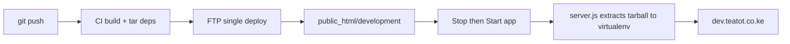

# Deployment — Tea Tot Hotels (cPanel)

## Server layout

| | Path |
|---|------|
| Account home | `/home/teatotco` |
| Development site | `/home/teatotco/public_html/development` |
| Development virtualenv deps | `/home/teatotco/nodevenv/public_html/development/22/lib/node_modules` |
| Production site | `/home/teatotco/public_html/production` |

FTP `server-dir` is **relative to account home** (`/home/teatotco`).

## Branch → environment

| Branch    | URL                      | App path    | Build trigger        |
|-----------|--------------------------|-------------|----------------------|
| `develop` | https://dev.teatot.co.ke   | `public_html/development`  | push → GitHub Actions |
| `main`    | https://www.teatot.co.ke   | `public_html/production`   | push → GitHub Actions |

**Everything builds in GitHub Actions.** Dependencies are installed in CI and uploaded to the CloudLinux **virtualenv** — you never run **Run NPM Install** on cPanel after deploy.

---

## One-time setup

### 1. GitHub repository secrets

| Secret | Value |
|--------|-------|
| `CPANEL_FTP_HOST` | FTP host |
| `CPANEL_FTP_USER` | `teatotco` (FTP root must be `/home/teatotco`) |
| `CPANEL_FTP_PASSWORD` | cPanel password |

### 2. Subdomain (development)

1. cPanel → **Domains** → **dev.teatot.co.ke** → document root `public_html/development`
2. Enable SSL (AutoSSL)

### 3. Node.js application (development)

cPanel → **Setup Node.js App** → **Create Application**:

| Field | Value |
|-------|-------|
| Node.js version | **22.x** (must match `22` in virtualenv FTP path) |
| Application mode | Production |
| Application root | `public_html/development` |
| Application URL | `dev.teatot.co.ke` |
| Application startup file | `server.js` |

On first create, cPanel adds a `node_modules` **symlink** in the app root pointing at the virtualenv. Do not delete that symlink.

### 4. Environment variables

| Variable | Development |
|----------|-------------|
| `NODE_ENV` | `production` |
| `NODE_OPTIONS` | `--max-old-space-size=512` |
| `NEXT_PUBLIC_SITE_URL` | `https://dev.teatot.co.ke` |
| `CONTACT_EMAIL` | `info@teatot.co.ke` |

---

## Deploy (development)

```bash
git push origin develop
```

GitHub Actions will:

1. `npm ci` + `npm run build`
2. Install 4 runtime packages in CI and pack them as `tmp/node_modules.tar.gz` (~80 MB)
3. FTP app files + tarball → `public_html/development/`

### After each deploy

1. cPanel → **Setup Node.js App** → **STOP APP**
2. Wait for GitHub Actions to finish
3. **START** the app — `server.js` extracts deps into the virtualenv on boot (first start may take ~30s)
4. Open https://dev.teatot.co.ke/

**Do not click Run NPM Install.**

---

## How deploy works



One FTP upload (including one ~80 MB tarball) avoids FTPS dropping connections on thousands of tiny `node_modules` files. `server.js` extracts into the CloudLinux virtualenv when the SHA changes.

---

## One-time cleanup (if npm install was already broken)

Stop the app, then run this **once** via Cron Jobs:

```text
rm -rf /home/teatotco/nodevenv/public_html/development/22/lib/node_modules && mkdir -p /home/teatotco/nodevenv/public_html/development/22/lib/node_modules
```

Then redeploy from `develop` and **Start** the app (extraction runs automatically).

---

## Troubleshooting

| Symptom | Fix |
|---------|-----|
| **FTP FIN packet / connection closed** | Fixed by shipping `tmp/node_modules.tar.gz` instead of uploading `node_modules` file-by-file. |
| **ENOTEMPTY on Run NPM Install** | Do not use Run NPM Install. Use deploy + Stop → Start. |
| **Cannot find module 'next'** | Stop app, confirm `tmp/node_modules.tar.gz` exists, Start app, check `stderr.log` for extract errors. |
| **503 on first start after deploy** | Extraction can take ~30s — wait and refresh. If it persists, check `stderr.log`. |
| **503** | Confirm `.htaccess` exists. Stop → Start. |
| **Wrong Node version on cPanel** | Virtualenv path uses your Node major version (e.g. `22`). |

---

## Production (when ready)

Push to `main` — workflow deploys to `public_html/production` with the same tarball extract flow.
